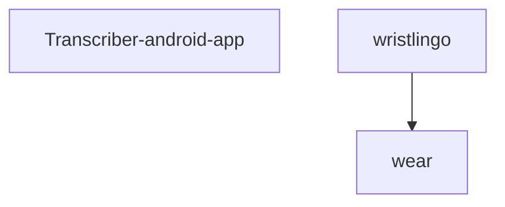

# Repository Map: WristLingo (Android + Wear OS)

**WristLingo** is an offline-first Android + Wear OS translation app that captures speech on the watch, processes it on the phone using on-device ASR (Whisper) and translation (ML Kit), and streams live captions back to the watch.

## Repository Structure

```
Transcriber-android-app/
├── app/                    # Main Android phone application
│   ├── src/main/
│   │   ├── java/com/example/wristlingo/
│   │   │   ├── providers/  # ASR & Translation providers
│   │   │   ├── data/       # Database & data management
│   │   │   ├── wear/       # Wear OS communication
│   │   │   └── ...         # Core app components
│   │   └── cpp/            # Native Whisper JNI integration
│   └── build.gradle.kts    # App module build config
├── wear/                   # Wear OS companion application
│   └── src/main/java/com/example/wristlingo/wear/
├── docs/                   # Architecture & design documentation
├── codex/                  # AI assistant prompts & guidance
├── gradle/                 # Gradle version catalog & wrapper
└── build.gradle.kts        # Root project configuration
```

## Modules Overview

### Transcriber-android-app
**Path:** `.`  
**Language:** gradle  
**Type:** package  

**Purpose:** Gradle multi-module project with 1 modules

**Submodules:** :app
**Entrypoints:** gradlew

### wear
**Path:** `wear`  
**Language:** kotlin  
**Type:** library  

**Purpose:** uses Jetpack Compose UI

**Key Classes:** MainActivity
**Key Functions:** onDestroy, WearScreen, send, onCreate, onMessageReceived
**Entrypoints:** MainActivity
**External Dependencies:** compose.ui, androidx.activity.compose, play.services.wearable

### wristlingo
**Path:** `app`  
**Language:** kotlin+cpp  
**Type:** library  

**Purpose:** contains background services; implements provider pattern; includes database layer; uses Jetpack Compose UI; integrates Whisper ASR; includes native C++ code

**Key Classes:** ExportActivity, SimpleVad, WearBridge, State, MainActivity
**Key Functions:** analyze, esc, PreviewHome, startWork, HomeScreen
**Entrypoints:** MainActivity
**External Dependencies:** androidx.lifecycle.runtime.ktx, androidx.core.ktx, androidx.activity.compose
**Internal Dependencies:** wear
**Tests:** 1 test files

## Module Dependencies



## Build & Runtime Requirements

**Build Requirements:**
- Android SDK (API 35)
- Build-Tools 35.0.0
- JDK 17+ (auto-provisioned via Foojay resolver)
- NDK (for Whisper C++ integration)

**Runtime Requirements:**
- Phone: Android 8.0+ (API 26+)
- Watch: Wear OS 4+

**Build Commands:**
```bash
# Debug builds (all flavors)
./gradlew :app:assembleDebug :wear:assembleDebug

# Release builds
./gradlew :app:assembleRelease :wear:assembleRelease

# Run tests
./gradlew :app:testOfflineDebug
```

## Product Flavors

The app supports three build flavors for different usage scenarios:

- **`offline`** - Whisper + ML Kit only (fully offline)
- **`hybrid`** - System SpeechRecognizer/Whisper + Cloud Translation (toggle)
- **`cloudstt`** - Enables Cloud STT v2 option (explicit opt-in)

## Architecture Highlights

**Data Flow:**
1. Watch captures audio via microphone
2. Small PCM frames (200-300ms) sent to phone via Data Layer
3. Phone processes audio with ASR (Whisper/System)
4. Text translated using ML Kit (on-device)
5. Captions streamed back to watch in real-time
6. Sessions stored in Room database for review

**Key Patterns:**
- **Provider Pattern:** Pluggable ASR (`AsrProvider`) and Translation (`TranslationProvider`) providers
- **Repository Pattern:** Data access abstraction with Room database
- **Foreground Service:** `TranslatorService` handles background processing with proper notifications
- **Data Layer Messaging:** `WearBridge` manages watch-phone communication via MessageClient
- **Native Integration:** JNI bridge for Whisper.cpp ASR (currently stubbed for future implementation)

**Core Components:**
- **`TranslatorService`:** Main foreground service orchestrating audio capture, processing, and communication
- **Provider Implementations:** `SystemSpeechRecognizerProvider`, `WhisperCppProvider` (stub), `MlKitTranslationProvider`
- **Data Layer:** Room entities (`Session`, `Utterance`) with optional PII redaction via `Redactor`
- **Wear Communication:** Bidirectional messaging for captions and control commands

## Complexity Hotspots

Files requiring attention due to size or complexity:

- **app/src/main/java/com/example/wristlingo/TranslatorService.kt** (254 LOC) - large file
- **app/src/main/java/com/example/wristlingo/TranslatorService.kt** (254 LOC) - large file
- **app/src/main/java/com/example/wristlingo/MainActivity.kt** (249 LOC) - large file
- **app/src/main/java/com/example/wristlingo/MainActivity.kt** (249 LOC) - large file

## Security & Privacy

- **On-device by default:** ASR and translation happen locally
- **Explicit cloud opt-in:** Cloud features disabled by default
- **PII redaction:** Optional redaction of sensitive information
- **Proper permissions:** Microphone, foreground service, wake lock
- **Secure storage:** Room database with optional encryption

## Development Workflow

**Local Development:**
1. Clone repository and ensure Android SDK is configured
2. Create `local.properties` with SDK path
3. Optionally create `keystore.properties` for release signing
4. Run `./gradlew :app:assembleOfflineDebug :wear:assembleOfflineDebug`

**Testing:**
- Unit tests: `./gradlew :app:testOfflineDebug`
- Integration tests available for providers and data layer
- Manual testing via debug builds on paired devices

**CI/CD:**
- **GitHub Actions:** `.github/workflows/android.yml` and `android-ci.yml`
- **Build Matrix:** Builds all debug flavors (offline, hybrid, cloudstt) on push/PR
- **Artifacts:** APKs uploaded for both phone and watch modules
- **Release Pipeline:** Optional signed releases on tags with keystore secrets
- **Java 21:** Uses Temurin distribution with Gradle caching
- **SDK Management:** Auto-installs Android SDK 35 and Build Tools 35.0.0

## Extension Points

**Adding New Providers:**
1. Implement `AsrProvider` or `TranslationProvider` interface
2. Add provider to DI configuration
3. Update settings UI for selection

**Adding New Features:**
- Export formats: Extend `Export.kt` with new serializers
- Audio processing: Add VAD or noise reduction in `audio/`
- UI components: Leverage Compose architecture
- Data Layer: Add new message types in `WearBridge.kt`
