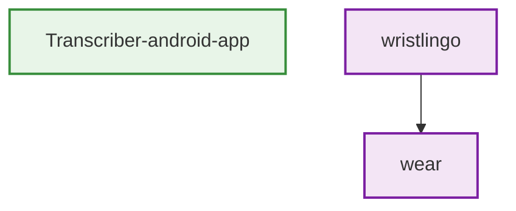
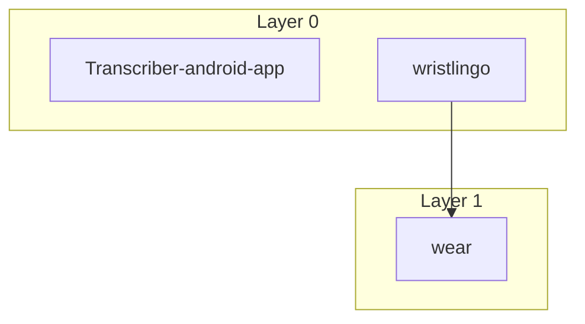
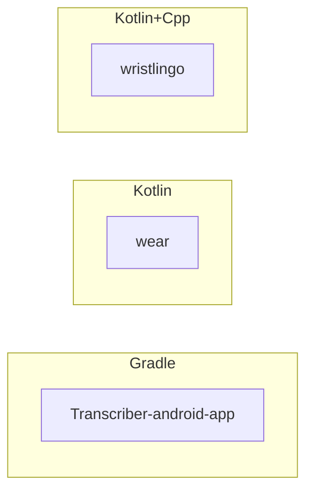

# Architecture Graphs

## Module Dependencies



## Layered Architecture



## Technology Stack



## Api Surface

```mermaid
graph TD
  Transcriber_android_app[Transcriber-android-app]:::module
  wear[wear]:::module
  wear_MainActivity[MainActivity]:::class
  wear --> wear_MainActivity
  wristlingo[wristlingo]:::module
  wristlingo_ExportActivity[ExportActivity]:::class
  wristlingo --> wristlingo_ExportActivity
  wristlingo_SimpleVad[SimpleVad]:::class
  wristlingo --> wristlingo_SimpleVad
  wristlingo_WearBridge[WearBridge]:::class
  wristlingo --> wristlingo_WearBridge

  classDef module fill:#e3f2fd,stroke:#1976d2,stroke-width:2px
  classDef class fill:#fff3e0,stroke:#f57c00,stroke-width:1px
```

